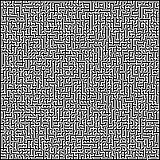

# Maze Solver

## About

A short program which solves mazes using various algorithms, written
in Rust. It is adapted from Dr. Mike Pound's Computerphile
[video](https://www.youtube.com/watch?v=rop0W4QDOUI)
and Python [code](https://github.com/mikepound/mazesolving).
My goal with this project was to practice using the Rust language and
reacquaint myself with pathing algorithms.

## Example

### Unsolved Maze

### Solved Maze

## Build

Assuming Rust's build tool and package manager, Cargo, is already
installed:

1. clone repository
2. change directory to the cloned repository
3. run 'cargo build --release' in the repository directory

## Run

maze_solver input \[-a algorithm\] \[-o output directory\]

## Input

Taken from Dr. Pound's documentation:

> Some example mazes are included in the repository. These were generated
> either by hand, or using the software
> [Daedalus](http://www.astrolog.org/labyrnth/daedalus.htm). Once
> exported I edited the mazes to ensure that the following rules are
> adhered to:
>
> - Each maze is black and white. White represents paths, black represents
>   walls.
> - All mazes are surrounded entirely by black walls.
> - One white square exists on the top row of the image, and is the start
>   of the maze.
> - One white square exists on the bottom row of the image, and is the end
>   of the maze.

Currently, the program only accepts png files.  
There are some example mazes in the ./img directory.
